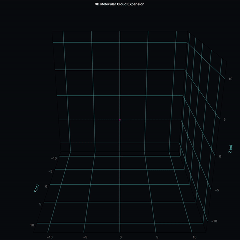

# Automated Physics Simulation & V&V Test Pipeline
[](https://github.com)

A high-performance 3D parallel physics engine evaluating stochastic Brownian molecular diffusion under external aerodynamic drift (wind fields). This repository is built as a Test Automation framework utilizing Verification and Validation (V&V) principles to verify numerical simulation integrity against mathematical laws.

## 🌟 Simulation Preview
 

## 🛠️ Tech Stack & Architecture
- **Language**: Julia 1.10+ (Native multi-threading optimization)
- **CI/CD Platform**: GitHub Actions DevOps
- **Graphics Engine**: CairoMakie.jl (High-performance vector rendering)
- **CLI Framework**: ArgParse.jl (Type-safe parameter parsing)

## 🧬 Automated Verification & Validation (V&V) Framework
Unlike standard deterministic software unit tests, a stochastic Monte Carlo model requires physical and statistical assertions. The test suite (`test/runtests.jl`) validates code execution via three layers:

1. **Numerical Cleanliness**: Asserts array dimensional shapes and verifies that no mathematical operations result in data corruption (`NaN` or `Inf`).
2. **Physical Boundary Invariance**: Asserts that all particles initialize strictly at the origin $(0,0,0)$ and that step variations comply with kinematic limits.
3. **Statistical Ensemble Validation**: 
   - Tracks **Spatial Isotropy** to verify uniform thermal dispersion across axes within a $15\%$ variance threshold.
   - Dynamically calculates the **Mean Squared Displacement (MSD)** using the core thermodynamic equation: 
     $$MSD = 2dDt + (v_{wind} \cdot t)^2$$
     The pipeline automatically aborts the visualization render if empirical simulation data drifts from this analytical textbook truth.

## 🚀 Getting Started & Local CLI Usage
This project behaves as a fully decoupled command-line interface tool. You can loop over scenarios from outside the scripts using the bash runner.

```bash
# Clone the repository
git clone git@github.com:PGComplexSystems/3dDiffusion.git
cd 3dDiffusion

# Execute a custom scenario: ./run_pipeline.sh <STEPS> <PARTICLES> <WIND_SPEED>
./run_pipeline.sh 1600 300 2.5
```

features to add: config file, parameters in plot 
